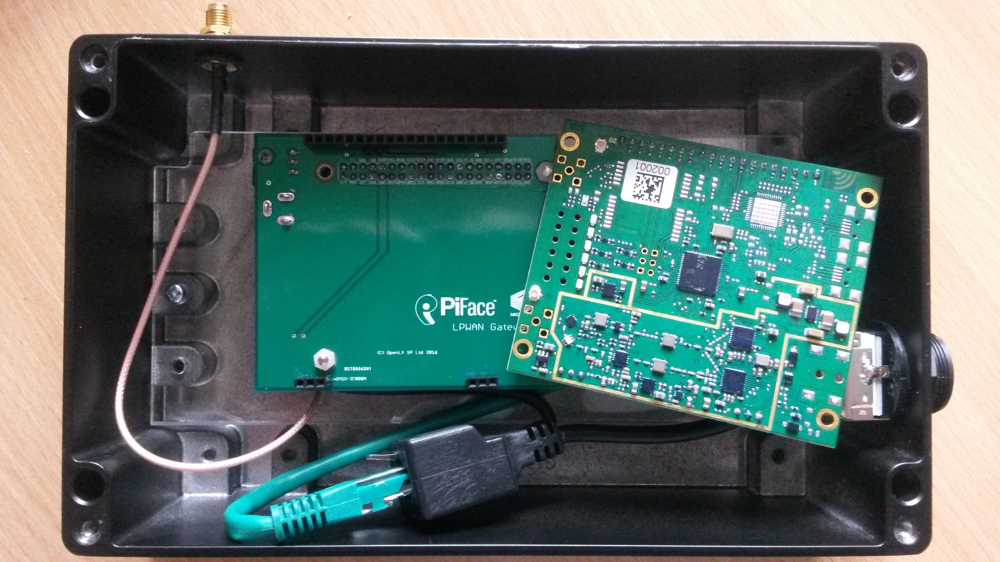
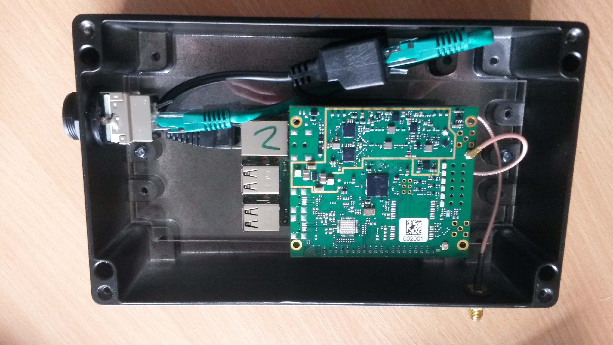

# Rpi-gateway
Files to build a LoraWan Gateway. Gerbers provide an easy and reliable way to connect the Raspberry Pi with the IMST ic880A gateway board. We have deploy quite a few of these as part of the Things Network Oldham and Connected Hull. Software used on the gateways by the project is here: https://github.com/ConnectedHull/ic880a-gateway 

For more details about the Gateways in use see http://www.connectedhull.net or http://https://www.thethingsnetwork.org/community/oldham/ 

https://twitter.com/fortyfourmu?lang=en

You can order the 
http://webshop.imst.de/radio-modules/lora-concentrators/ic880a-spi-lorawan-concentrator-868mhz.html
